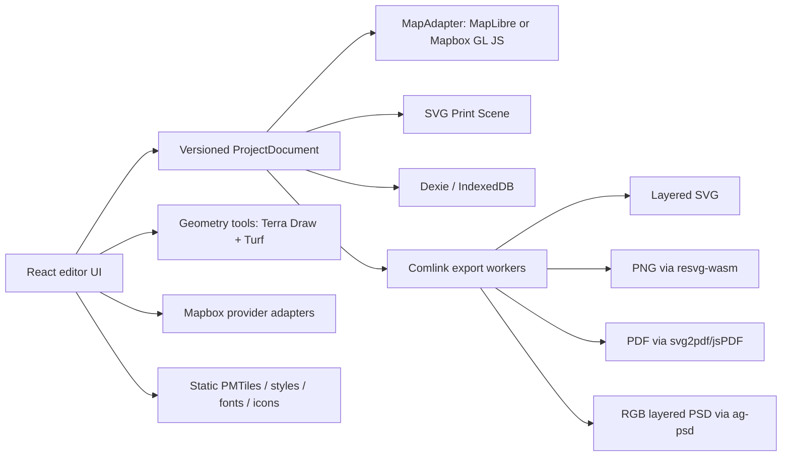

# Client-Side Print Map Studio Implementation Plan

> **For Hermes:** Use subagent-driven-development skill to implement this plan task-by-task.

**Goal:** Build a static-hosted, free-to-the-user map-design application that reproduces the useful Printmaps editor workflow entirely in the browser, with Mapbox used only for approved search/routing services and open tools/data used elsewhere.

**Architecture:** A versioned project document is the single source of truth. One renderer provides the interactive map; a separate SVG-based print scene produces downloads in browser workers. The application has no application server, account system, checkout, or paid export path, but it still makes network calls to Mapbox and to static tile/data origins.

**Tech Stack:** TypeScript, React, Vite, MapLibre GL JS or Mapbox GL JS behind an adapter, PMTiles/OpenMapTiles-compatible data, Terra Draw, Turf, toGeoJSON, SVG.js, resvg-wasm, jsPDF/svg2pdf.js, ag-psd, Dexie, Comlink, Vitest, Playwright.

---

## 1. Scope and definition

“Client-side” means:

- the shipped product is a static SPA;
- project state, imports, geometry processing, compositing, and export run locally in the browser;
- no application database, render server, queue, login, checkout, email delivery, or proprietary print server is required;
- Mapbox search/routing and static map-data origins remain external network dependencies;
- public browser tokens are expected to be visible and must be origin/scope restricted;
- large static tile archives may be served from object storage/CDN, which is static hosting rather than an application backend.

“Free” means no product paywall and no per-export fee. It does **not** mean unlimited Mapbox usage, free global tile hosting, or zero third-party terms. Current Mapbox pricing and quotas must be treated as deployment configuration, not hard-coded assumptions.[42]

## 2. Main Printmaps application inventory

The live editor and public documentation expose three primary stages—Design Map, Add Content, and Download Map—plus Open, Save, Share, Preview, and Fullscreen. The product’s documented high-resolution outputs are PNG, layered PSD, and layered SVG.[26][27][28]

### 2.1 Design Map

| Capability | Observed/documented behavior | Clone priority |
|---|---|---|
| Camera and frame | Pan, zoom, scale display, map-area lock, geolocation, address jump | MVP |
| Print size | A2–A6, US Letter, custom physical dimensions; current published caps are 220 mm PNG, 660 mm PSD, 1,330 mm SVG | MVP |
| Orientation | Rotate; pitch/tilt; rotated/tilted output is not available as SVG in Printmaps | MVP, with export warning |
| Text scale | Global text-size scaling while preserving extent | MVP |
| Styles | Terrain, Light, Dark visible initially; “Show all” exposes more styles | MVP: 3–5 open styles |
| Advanced detail | “Ultra High-Res Maps” displays a higher-detail zoom level | Phase 2 |
| Language | Default/local plus English, German, French, Italian, Spanish, Chinese | Phase 2 |
| Feature visibility | Toggle categories such as land use, buildings, parks, woods, grass, contours, roads, casings, and labels | MVP for major categories |
| Aerial background | Printable aerial imagery in selected countries | Phase 3, source/licence dependent |
| Preview | Low-resolution preview before export | MVP |

There is a documented/live discrepancy around maximum pitch: the current input advertises a wider range than the feature page’s 60° statement. Implement 0–60° first and add a parity fixture before widening it.[27]

### 2.2 Add Content

| Capability | Observed/documented behavior | Clone priority |
|---|---|---|
| Easy route | Search start/stops; air, ship, train, car, bike, walk; optional mode icons | MVP |
| Expert route | Click points; magnetic road snapping, straight lines, curved/arced lines; color and width; undo | MVP |
| Route API constraints | Directions for waypoints; Map Matching for noisy traces | MVP after Mapbox gate |
| File import | Drag/drop or browse GPX, KML, GeoJSON; multiple overlays | MVP |
| Single POI | Place by map movement/search/coordinate; shape, inner label/icon, color, size, custom image | MVP |
| Bulk POIs | Spreadsheet with Name, Street, Postcode, City, Country, Longitude, Latitude, Found; up to 300 rows in the live editor | Phase 2 |
| POI database | Select visible POIs from Groceries, Shopping, Food and Drink, Public Transport, Education, Amenities, Tourism, Leisure | Phase 2 |
| Administrative shapes | Roughly 600,000 selectable borders; adjacent shapes auto-merge; fill/stroke/color/opacity/invert | Phase 2 |
| Travel-time shape | Walk, bicycle, car; origin by map/search; time, color, width, invert, label | Phase 2 |
| Komoot | OAuth login and selection of saved tours; recorded tours always shown; some planned tours depend on Komoot region access | Phase 3 |
| Layer list | Named content layers; reorder, hover-highlight, hide/show, edit/replace, remove | MVP |

The current live Add Geo-Shape button was CSS-hidden in the inspected layout, but its modal still exists and documents administrative-border selection and automatic merging. Treat this as a supported capability with a current UI/feature-flag inconsistency, not an MVP navigation pattern to copy.

### 2.3 Persistence and export

| Capability | Observed/documented behavior | Clone priority |
|---|---|---|
| Save/Open | Save project and reopen it later | MVP |
| Share | Share the map/project with another user | MVP via project file; URL hash for small projects |
| Free web ZIP | Downscaled web image; attribution and no-modification terms in Printmaps | Replace with unrestricted local export plus source attribution obligations |
| PNG | Flat 300-dpi raster | MVP |
| SVG | Layered and scalable; Printmaps claims map-feature layers | MVP with explicit raster-basemap limitation |
| PSD | Named layers at 300 dpi | Phase 2, RGB raster layers |
| PDF | Not a core Printmaps editor output, but useful and supported by its separate elevation tool/API ecosystem | MVP |
| Multiple maps/cart | Checkout can hold multiple maps | Out of scope; use multiple local project files |
| Payment/licensing/email | Circulation licence, invoice, payment, delayed server generation/email | Out of scope |

### 2.4 Secondary product surface

These are real adjacent features but should not block the first editor release:

- elevation-profile maker from GPX/KML/GeoJSON or drawn route, with PDF/SVG/PNG export;
- direct Komoot and GPS-service workflows;
- bulk/automated Static Maps/Printmaps API;
- WordPress plugin/white-label embedding;
- specialized presets for real estate, tourism, architecture/site analysis, posters, photobooks, and road trips.[27][28][29]

## 3. Feasibility classification

### Straightforward in a browser

- map navigation and style switching;
- page frame, physical dimensions, rulers, lock, preview;
- routes, POIs, shapes, layer ordering;
- GPX/KML/GeoJSON parsing;
- project save/open/autosave;
- PNG, PDF, and layered SVG where the basemap is raster and user overlays remain vector.

### Feasible with constraints

- high-resolution tiled/strip raster output;
- PSD with named 8-bit RGB raster layers;
- bulk geocoding and POI databases;
- administrative-boundary selection from static PMTiles;
- elevation profiles;
- isochrones within Mapbox API limits;
- compact URL sharing.

### Not equivalent without a new cartographic renderer

- arbitrary MapLibre/Mapbox styles exported as a fully vector, semantically layered SVG;
- every road, water, building, hillshade, and label preserved as editable vectors/layers exactly like Printmaps;
- giant 300-dpi poster output without browser/GPU/memory guards;
- press-certified CMYK, PDF/X, ICC output intents, spot colors, or overprint.

MapLibre is a WebGL renderer; its canvas is raster at export time. `maplibre-gl-export` can quickly produce PNG/JPEG/PDF/SVG, but its PDF/SVG modes wrap a composed raster rather than recreate a vector basemap.[1][11] A true all-vector basemap would require a separate, deliberately limited vector-tile-to-SVG cartographic renderer. No maintained browser library currently provides full style evaluation, line placement, collision detection, glyph shaping, terrain, and feature-layer export as a turnkey component.

## 4. Recommended open-source/tool mapping

| Product need | Recommended tool | Licence / role | Important caveat |
|---|---|---|---|
| Interactive map | MapLibre GL JS | BSD-3; vector/raster WebGL map.[1] | Subject to Mapbox service-display gate below |
| Style JSON | MapLibre Style Spec + Maputnik | Open style model/editor.[2][38] | Keep styles and data-source licences separate |
| Static tiles | PMTiles JS + Protomaps/OpenMapTiles-compatible archives | BSD-3 reference implementation; static range requests.[3][35] | Archive/data hosting and OSM attribution remain deployment work |
| Hosted MVP tiles | OpenFreeMap | Open MapLibre-compatible service.[34] | Third-party uptime/usage policy; not offline |
| Drawing/editing | Terra Draw MapLibre adapter | MIT; points/lines/polygons/circles.[9] | Add integration tests around renderer upgrades |
| Geometry | Turf | MIT; measurements, simplify, bbox, transforms, great-circle/arc helpers.[30] | Not a road-network matcher |
| GPX/KML/TCX import | `@tmcw/togeojson` | BSD-2; XML to GeoJSON.[10] | Sanitize metadata and cap coordinate counts |
| Icons | Maki + application SVG set | CC0 cartographic icons.[39] | Recreate printable icons in the print scene |
| Print scene | SVG.js | MIT; named groups, paths, clipping, text, assets.[12] | Embed assets/fonts; avoid external CSS |
| PNG | `@resvg/resvg-wasm` | MPL-2; deterministic SVG rasterization.[14] | Tile/strip large pages in workers |
| PDF | jsPDF + svg2pdf.js | MIT; vector page plus raster basemap.[13] | Not PDF/X or a prepress engine |
| PSD | ag-psd | MIT; browser PSD writer.[15] | RGB 8-bit; raster layers; no reliable editable text/CMYK/PSB |
| Fonts | OpenType.js; HarfBuzz JS/Wasm when needed | MIT; metrics/outlines and complex shaping.[16][17] | Outline conversion increases size |
| Persistence | Dexie/IndexedDB | Apache-2; versioned local project DB.[19] | Origin quota/eviction; always offer project export |
| Workers | Comlink + Web Workers | Apache-2 RPC wrapper.[20] | Transfer buffers rather than cloning them |
| Compression | fflate | MIT; project ZIP and compact share payloads.[31] | URL sharing must enforce size limits |
| Elevation chart | uPlot | MIT; fast client chart.[40] | Elevation data source still required |
| Test stack | Vitest + Playwright + pixel/structure checks | Browser and unit verification.[21][41] | Keep separate visual baselines per browser/GPU when needed |

### Open data

- Natural Earth for low-zoom countries/coastlines is public-domain-oriented and suitable for static preprocessing.[37]
- Overture Maps can supply openly licensed places/divisions/buildings for static data products, subject to each theme’s current licence and attribution requirements.[36]
- OSM/OpenMapTiles-derived vector tiles require OSM attribution and ODbL-aware data handling.
- Do not use the public `tile.openstreetmap.org` service for print rendering or bulk export.

## 5. Mapbox contract and API gate — must happen before production coding

### 5.1 Confirmed service behavior

- Geocoding v6 supports forward, reverse, and batch geocoding. Temporary results cannot be cached; permanent storage requires `permanent=true` plus account prerequisites.[4]
- Search Box uses suggest/retrieve sessions and temporary results.[5]
- Directions provides driving, traffic, walking, and cycling routes and waypoint limits.[6]
- Map Matching accepts up to 100 ordinary coordinates per request and cleans noisy traces.[7]
- Isochrone supports driving, cycling, and walking, up to four contours and a maximum of 60 minutes—not Printmaps’ live 180-minute control.[33]
- browser credentials must be public `pk` tokens with least scopes and URL restrictions; secret tokens must never ship.[8]

### 5.2 Contractual blocker

Current Mapbox documentation states that Geocoding responses may only be used with a Mapbox map. Map Matching is more explicit: results must be displayed on a Mapbox map using Mapbox libraries or SDKs.[4][7]

Therefore, **do not ship MapLibre + Mapbox Geocoding/Map Matching without written Mapbox confirmation that this use is permitted**.

### 5.3 Renderer decision paths

1. **Recommended compliance-first path:** keep a `MapAdapter` boundary and use Mapbox GL JS for the interactive map if Mapbox confirms that is required. Continue to use open basemap data/styles and the independent open export pipeline. Trade-off: the renderer dependency is proprietary, though still client-side and potentially within the free usage tier.
2. **Open-renderer path:** use MapLibre only after written Mapbox approval/contract language for the intended display/export workflow.
3. **All-open path:** replace Mapbox with a self-hosted/open geocoder/router/matcher. This violates the current “no backend other than Mapbox” constraint; Valhalla, OSRM, and GraphHopper are maintained server/native systems, not practical full-world client-only Wasm dependencies.[23][24][25]

This is the first go/no-go decision.

### 5.4 Token and persistence rules

- accept a deploy-time public token or a user-provided public token;
- never accept/store an `sk` secret in the browser;
- restrict token origin URLs and scopes;
- debounce autocomplete, abort stale requests, and rate-limit bulk operations;
- do not persist temporary response payloads;
- do not save selected geocoder-derived coordinates into durable projects until Mapbox storage terms are explicitly satisfied;
- keep providers behind `SearchProvider`, `DirectionsProvider`, `MapMatchingProvider`, and `IsochroneProvider` interfaces.

## 6. Proposed architecture



### 6.1 Canonical document model

`ProjectDocument` must contain:

- schema version and migration metadata;
- page width/height in millimetres, orientation, bleed, intended DPI;
- camera/bounds/zoom/bearing/pitch/projection;
- style ID/version and visible style categories;
- attribution/provenance records;
- ordered `ContentLayer[]` with stable IDs, names, visibility, lock state, and type;
- GeoJSON geometry plus route/marker/shape presentation properties;
- embedded/custom assets by content hash;
- font references;
- export preferences;
- service-derived-data provenance and storage permission state.

Never reconstruct project truth from current DOM nodes or canvas pixels.

### 6.2 Dual rendering

**Interactive renderer**

- optimized for editing, map navigation, hit testing, feature previews, and normal screen DPI;
- content overlays use GeoJSON sources/layers or Terra Draw;
- style categories use metadata maintained in our own open style JSON.

**Print renderer**

- physical page coordinates in mm/points;
- named SVG `<g>` groups matching project layers;
- one or more clipped high-resolution raster images for the basemap;
- vector routes, POIs, shapes, labels, legends, scale bars, frames, credits, crop/bleed marks;
- deterministic font loading and asset embedding;
- structure is reusable across SVG, PNG, PDF, and PSD.

### 6.3 Large export strategy

1. Convert physical page dimensions to target raster pixels only for raster formats.
2. Query browser/GPU limits before allocating.
3. Render basemap in overlapping tiles/strips.
4. Wait for map idle, tile completion, images, and fonts.
5. Compose overlays independently in print coordinates.
6. Refuse exports above a configurable memory budget with an exact explanation.
7. Report missing tile/font/image failures; never silently export an incomplete map.

## 7. Proposed repository structure

The workspace currently contains research artifacts but no application scaffold. Create:

```text
package.json
pnpm-lock.yaml
vite.config.ts
tsconfig.json
src/
  app/
    App.tsx
    routes.tsx
    store.ts
  domain/
    project.ts
    layers.ts
    styles.ts
    migrations.ts
    validation.ts
  map/
    MapAdapter.ts
    MapLibreAdapter.ts
    MapboxAdapter.ts
    camera.ts
    projection.ts
  services/mapbox/
    client.ts
    search.ts
    directions.ts
    mapMatching.ts
    isochrone.ts
    limits.ts
  data/
    pmtiles.ts
    boundaries.ts
    pois.ts
    attribution.ts
  features/design/
    DesignPanel.tsx
    PageFrame.tsx
    StylePanel.tsx
  features/routes/
    RouteWizard.tsx
    EasyRoute.tsx
    ExpertRoute.tsx
  features/import/
    ImportDialog.tsx
    parsers.ts
  features/pois/
    PoiEditor.tsx
    PoiSpreadsheet.tsx
  features/shapes/
    ShapeEditor.tsx
    IsochroneEditor.tsx
  features/layers/
    LayerList.tsx
  features/projects/
    ProjectOpen.tsx
    ProjectSave.tsx
    ProjectShare.tsx
  features/export/
    ExportPanel.tsx
    preflight.ts
  print/
    scene.ts
    basemap.ts
    svg.ts
    png.ts
    pdf.ts
    psd.ts
    fonts.ts
  workers/
    geometry.worker.ts
    export.worker.ts
    psd.worker.ts
  storage/
    db.ts
    assets.ts
    autosave.ts
  assets/
    styles/
    icons/
    fonts/
tests/
  unit/
  fixtures/
  e2e/
  visual/
```

## 8. Phased implementation plan

### Phase 0: De-risk the blockers

#### Task 0.1: Resolve Mapbox display/storage terms

**Objective:** Obtain a written answer or choose Mapbox GL JS before building provider-dependent UI.

**Files:**
- Create: `docs/decisions/0001-mapbox-renderer-and-storage.md`

**Acceptance:** Decision records renderer, whether durable coordinates are allowed, token model, export use, and attribution.

#### Task 0.2: Basemap/data spike

**Objective:** Render one open style from OpenFreeMap and one same-origin PMTiles fixture through the adapter.

**Files:**
- Create: `src/map/MapAdapter.ts`
- Create: `src/data/pmtiles.ts`
- Create: `tests/e2e/basemap.spec.ts`

**Acceptance:** Both sources display with correct credits; tile failure/CORS cases are visible.

#### Task 0.3: Export feasibility spike

**Objective:** Prove a page with a raster basemap and vector route/POI/shape exports to SVG, PNG, PDF, and PSD locally.

**Files:**
- Create: `src/print/scene.ts`
- Create: `src/workers/export.worker.ts`
- Create: `tests/e2e/export-spike.spec.ts`

**Acceptance:** SVG has named groups; PDF has exact page box; PNG has requested pixel dimensions; PSD can be read back with expected layer names/order.

#### Task 0.4: Browser memory envelope

**Objective:** Establish safe dimension/layer limits on Chromium, Firefox, and WebKit.

**Files:**
- Create: `src/features/export/preflight.ts`
- Create: `tests/e2e/export-limits.spec.ts`

**Acceptance:** app refuses unsafe jobs before allocation and never crashes the tab in the fixture matrix.

### Phase 1: Core editor and useful free export

#### Task 1: Project foundation

- scaffold React/Vite/TypeScript/pnpm;
- define versioned `ProjectDocument` and migrations;
- add application state, undo/redo, error boundary;
- add Dexie autosave and explicit project JSON/ZIP export/import.

#### Task 2: Map design panel

- physical page frame and rulers;
- standard/custom sizes and orientation;
- camera, bearing, pitch, lock, scale, geolocation;
- three open styles;
- major feature/label category toggles;
- global text scale;
- credits and data provenance.

#### Task 3: Mapbox search and route providers

- token validation and origin/scopes guidance;
- debounced suggest/retrieve or Geocoding API search;
- waypoint Directions requests;
- Map Matching chunking with overlap and failure handling;
- no-cache/storage enforcement based on Task 0.1;
- 401/403/422/429/offline UX.

#### Task 4: Easy and Expert route tools

- searchable stops and mode sequence;
- driving/walking/cycling snapped segments;
- straight and great-circle/arc segments for air/ship/train;
- mode icons, color, width, hide/show;
- point insertion, drag editing, undo/redo;
- route layer names and reorder behavior.

#### Task 5: Import and content layers

- GPX/KML/GeoJSON drag/drop;
- validation and explicit feature/coordinate limits;
- multi-file fit-to-bounds prompt;
- styling, rename, hide, edit, replace, remove;
- ordered layer list with hover highlight.

#### Task 6: Single POIs and custom markers

- map/search/coordinate placement;
- standard Maki symbol set;
- marker shape, fill/stroke, inner icon/label, size;
- custom PNG/JPEG/SVG upload with validation;
- vector print-scene representation.

#### Task 7: MVP exports

- preflight summary;
- layered SVG with raster basemap + vector overlays;
- high-resolution PNG;
- vector PDF with raster basemap;
- background worker progress and cancellation;
- direct Blob download and optional File System Access enhancement.

### Phase 2: Printmaps feature breadth

#### Task 8: Bulk POI spreadsheet

- 300-row cap initially;
- columns matching the observed app;
- paste from Excel/Sheets;
- batch/queued geocoding with request budget preview;
- Found/ambiguous/not-found states and manual correction;
- no durable storage unless Mapbox terms permit it.

#### Task 9: Static POI database

- ingest Overture/OpenMapTiles POI data into static PMTiles;
- visible-extent query and category filters;
- select individual results and convert them into project-owned POI layers;
- retain source attribution.

#### Task 10: Administrative shapes

- static boundary PMTiles from Natural Earth/Overture/other approved datasets;
- choose by map and administrative level;
- merge adjacent polygons with Turf/polygon clipping;
- fill/stroke/opacity/invert and border recipe;
- geometry complexity guards.

#### Task 11: Isochrones

- walk/bike/car origin by map/search;
- up to four contours and 60 minutes when using Mapbox;
- color, stroke width, fill opacity, label, invert;
- explicitly show that 61–180 minute parity is unavailable with the selected API.

#### Task 12: Layered PSD

- rasterize each top-level print group independently;
- write named 8-bit RGB layers and flattened composite with ag-psd;
- re-open generated files during tests;
- publish hard pixel/layer/byte limits;
- label output “RGB layered PSD; text and basemap are not fully editable vectors.”

#### Task 13: Expanded styles and language

- Maputnik-maintained open style presets;
- local/selected-language label expressions where source data supports names;
- higher-detail mode;
- style/version migration.

### Phase 3: Secondary workflows

#### Task 14: Elevation profile maker

- route distance/elevation sampling from an approved open terrain source;
- line/gradient chart, metric/imperial, grid, markers, colors, font size;
- SVG/PNG/PDF export via the same print scene.

#### Task 15: Share and templates

- compressed URL hash for small asset-free projects;
- Web Share API and project ZIP for larger maps;
- templates for real estate, tourist guide, poster, photobook, road trip, and site analysis;
- never upload private projects silently.

#### Task 16: Optional integrations

- Komoot only after OAuth/app-registration and service-term review;
- aerial imagery only after print/export licence and CORS review;
- optional provider adapters for approved non-Mapbox deployments.

## 9. Testing and validation

### Unit/property tests

- coordinate ↔ page transformations;
- mm/pt/raster conversion;
- route chunk stitching;
- shape merge/invert;
- schema migration and layer ordering;
- serialization stability;
- export memory estimation.

Run:

```bash
pnpm test
```

### Fixture round trips

Include GPX/KML/GeoJSON with:

- tracks and routes;
- polygon holes and multipolygons;
- Unicode and complex scripts;
- altitude/time;
- malformed XML/JSON;
- large coordinate counts;
- custom marker assets.

### Browser E2E

```bash
pnpm exec playwright test
```

Test Chromium, Firefox, and WebKit with fixed DPR, fonts, style, tile fixtures, and mocked Mapbox responses. Cover offline, timeout, partial tiles, invalid token, restricted origin, 401/403/422/429, request cancellation, and export cancellation.

### Structural export tests

- parse SVG and assert named groups, clip paths, embedded assets, credits;
- inspect PDF page/media boxes, fonts, vectors, and raster effective PPI;
- decode PNG and assert dimensions/alpha/metadata policy;
- read PSD back with ag-psd and assert dimensions, composite, layer names/order/visibility.

### Visual regression

Use deterministic fixtures and tolerances. WebGL differs by GPU/driver, so structure tests are authoritative and pixel tests are supplemental.

### Print preflight acceptance

Every export must report:

- page size and target pixel dimensions;
- effective PPI of each raster layer;
- missing fonts/images/tiles;
- source credits/attribution;
- estimated memory/output size;
- RGB color-space warning;
- whether basemap is raster and overlays are vector;
- whether output is not PDF/X/press-certified.

## 10. MVP acceptance criteria

The first release is complete when a new user can:

1. open the static app without an account;
2. choose a page size/style and frame a location;
3. find an address using the approved Mapbox configuration;
4. create snapped and straight/arc route segments;
5. import GPX, KML, and GeoJSON;
6. add custom POIs;
7. reorder/hide/edit content layers;
8. save and reopen a project locally;
9. export PNG, PDF, and layered SVG locally;
10. see accurate preflight, attribution, API, and export-limit warnings;
11. complete the above in Playwright across Chromium, Firefox, and WebKit.

PSD, bulk POIs, POI database, boundaries, isochrones, elevation profiles, Komoot, and aerial imagery are post-MVP unless explicitly reprioritized.

## 11. Key risks and recommended decisions

1. **Mapbox display/storage terms — blocker.** Resolve before production implementation.[4][7]
2. **Layered SVG definition.** Recommend shipping a raster basemap plus vector user overlays and saying so clearly. Do not market it as a fully vector cartographic basemap.
3. **PSD definition.** Recommend RGB raster layers; no editable type, CMYK, PSB, or guaranteed Photoshop parity.[15]
4. **Basemap hosting.** Recommend same-origin PMTiles for controlled production deployments; OpenFreeMap is acceptable for an early prototype.[3][34][35]
5. **Color/prepress.** Recommend RGB SVG/PNG/PDF/PSD and printer-side conversion. A trustworthy PDF/X/CMYK path would require relaxing the browser-only constraint.
6. **Mapbox isochrone mismatch.** Cap at 60 minutes or change providers; do not fake Printmaps’ 180-minute setting.[33]
7. **Large posters.** Browser memory/GPU limits require strips, cancellation, hard guards, and honest maximums.
8. **Data licences.** Track attribution and provenance per style/source/asset; open-source code does not make map data licence-free.
9. **Public token abuse.** Restrict by origin/scope, budget-alert the Mapbox account, and expose graceful quota failure.
10. **No practical client-only global router fallback.** Open routing alternatives are server/native systems.[23][24][25]

## 12. Deliverables already produced during research

- `printmaps_public_capabilities_inventory.md` — public feature/support/API/legal inventory;
- `printmaps_browser_stack_research.md` — library, licence, maintenance, browser, export, and Mapbox analysis;
- `printmaps_support_articles.md` — extracted English support corpus;
- `printmaps-inspection/` — inspected client bundle/style artifacts;
- this implementation plan.

## Sources

[1] https://maplibre.org/maplibre-gl-js/docs
[2] https://maplibre.org/maplibre-style-spec
[3] https://github.com/protomaps/PMTiles
[4] https://docs.mapbox.com/api/search/geocoding
[5] https://docs.mapbox.com/api/search/search-box
[6] https://docs.mapbox.com/api/navigation/directions
[7] https://docs.mapbox.com/api/navigation/map-matching
[8] https://docs.mapbox.com/api/accounts/tokens
[9] https://github.com/JamesLMilner/terra-draw
[10] https://github.com/placemark/togeojson
[11] https://github.com/watergis/maplibre-gl-export
[12] https://github.com/svgdotjs/svg.js
[13] https://github.com/yWorks/svg2pdf.js
[14] https://github.com/thx/resvg-js
[15] https://github.com/Agamnentzar/ag-psd
[16] https://github.com/opentypejs/opentype.js
[17] https://github.com/harfbuzz/harfbuzzjs
[19] https://github.com/dexie/Dexie.js
[20] https://github.com/GoogleChromeLabs/comlink
[21] https://github.com/microsoft/playwright
[23] https://github.com/valhalla/valhalla
[24] https://github.com/Project-OSRM/osrm-backend
[25] https://github.com/graphhopper/graphhopper
[26] https://www.printmaps.net — Printmaps homepage and live editor
[27] https://www.printmaps.net/features — Printmaps feature inventory
[28] https://support.printmaps.net/en/support/home — Printmaps knowledge base
[29] https://www.maptoolkit.com/api/printmaps — Maptoolkit Printmaps API
[30] https://github.com/Turfjs/turf — Turf geospatial analysis library
[31] https://github.com/101arrowz/fflate — fflate compression library
[33] https://docs.mapbox.com/api/navigation/isochrone — Mapbox Isochrone API
[34] https://openfreemap.org — OpenFreeMap
[35] https://docs.protomaps.com/basemaps — Protomaps basemaps
[36] https://overturemaps.org — Overture Maps Foundation
[37] https://www.naturalearthdata.com — Natural Earth
[38] https://github.com/maputnik/editor — Maputnik style editor
[39] https://github.com/mapbox/maki — Maki icons
[40] https://github.com/leeoniya/uPlot — uPlot charting
[41] https://vitest.dev — Vitest
[42] https://www.mapbox.com/pricing — Mapbox pricing
